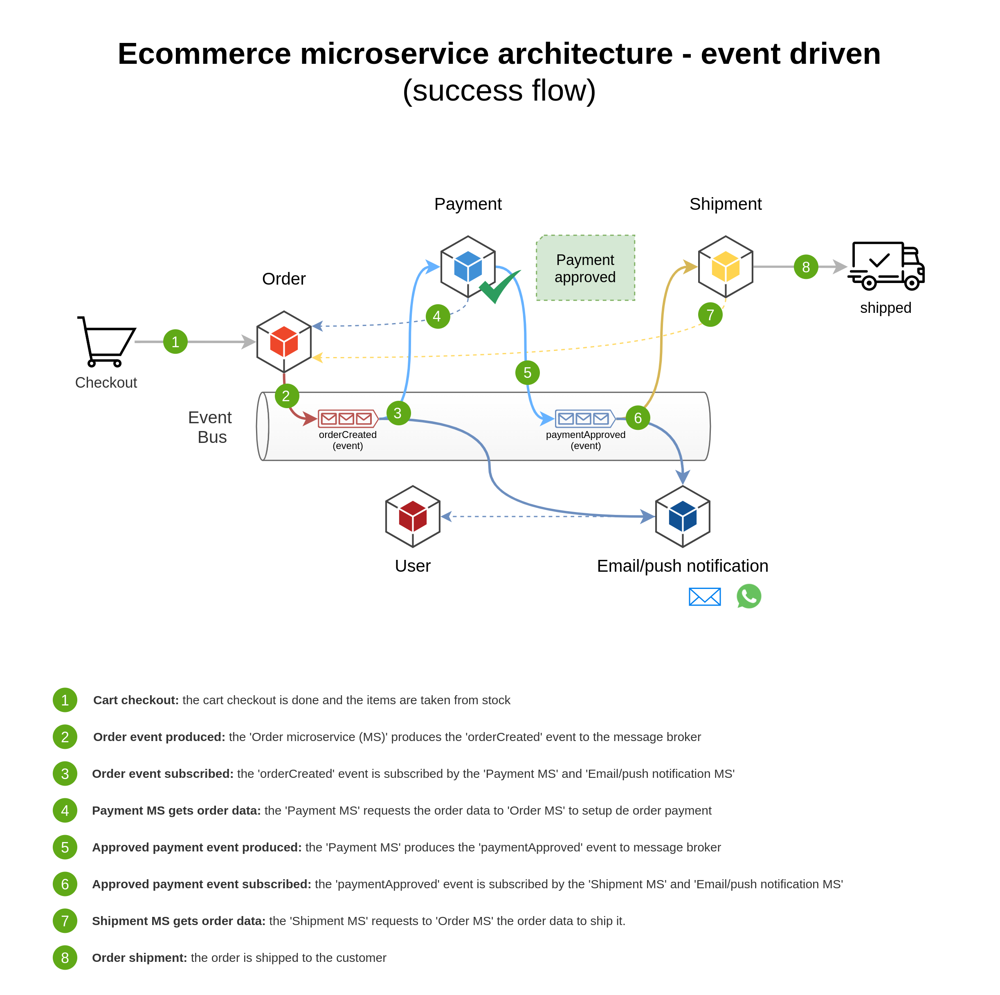

# Ecommerce microservice architecture project

This repository is a study project of event-driven microservices architecture that uses asynchronous communication between the microservices.
It based on an ecommerce case, and the business flow starts at the cart checkout and finishs at order shippment to the customer.

### Stack

  
  

### Notes

> The purpose of this project is only a study of the asynchronous communication between microservices and its use in a real business case. The choice of the programing language or database isn't relevant to scope of this study.
