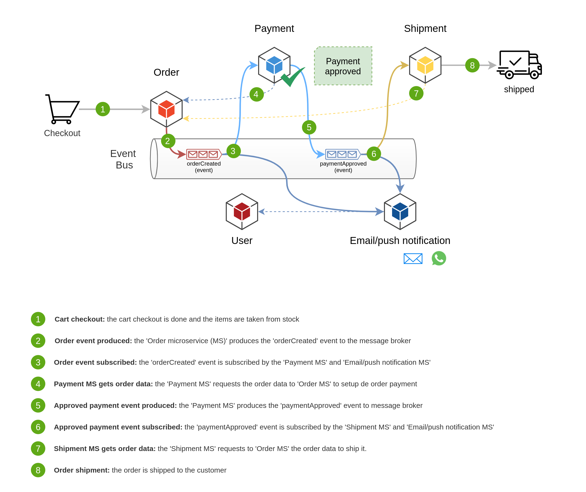

# Ecommerce event-driven architecture project

This repository is a study project of event-driven microservices architecture that uses asynchronous communication between the microservices.
It is based on an ecommerce case, and the business flow starts at the cart checkout and finishes at order shippment to the customer.

### Stack

  
  

